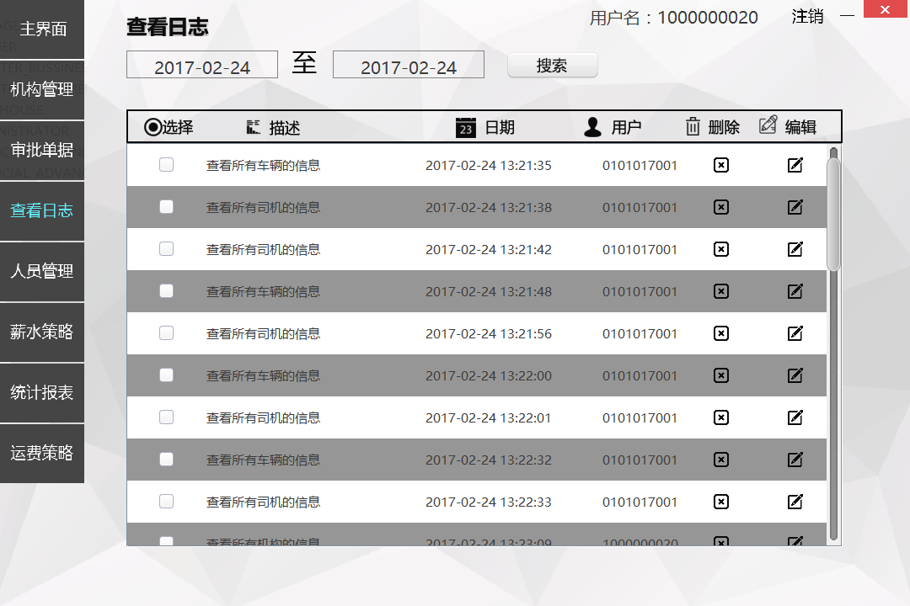
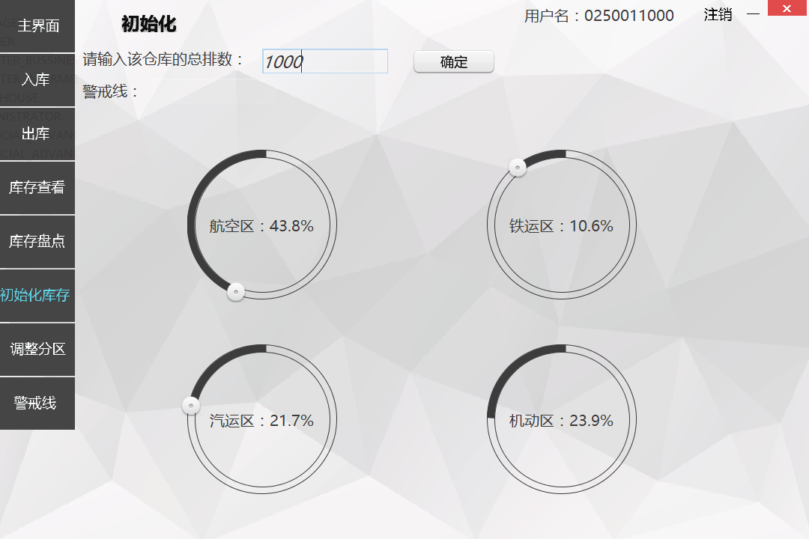
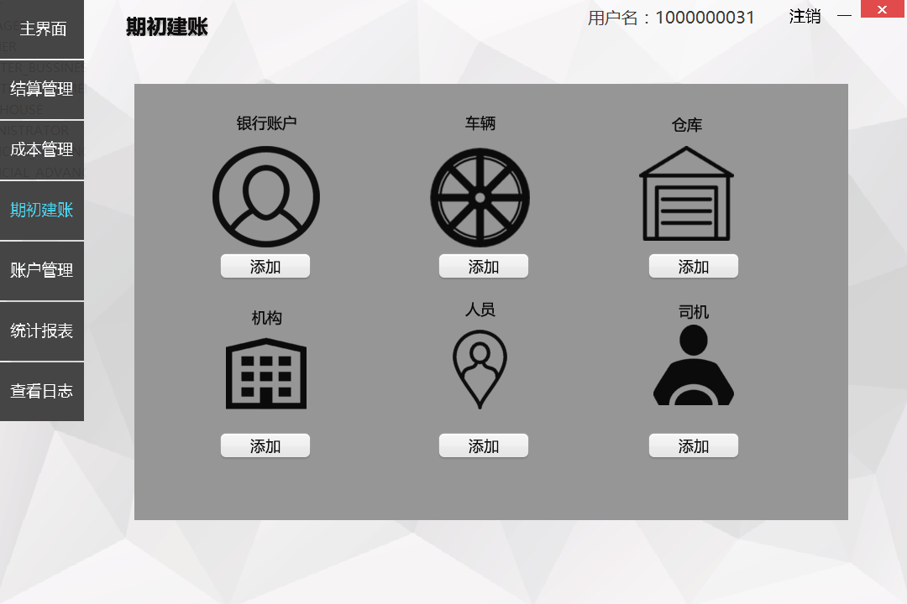

#LogisticSystem: 快递物流系统
===

##使用技术
分层架构 + Java Swing + RMI + JDBC + MySQL

##软件简介
快递物流系统主要用户为：寄件人、快递员、营业厅业务员、中转中心业务员、中转中心仓库管理人、财务人员、总经理、仓库管理人员、系统管理员

快递物流系统的主要模块包括：仓库管理、财务管理、日志模块、人员模块、运输模块、用户管理、机构管理等。

快递物流系统的具体功能参见[需求文档](https://github.com/niansong1996/LogisticsSystem/tree/master/Documentations/%E9%9C%80%E6%B1%82%E9%98%B6%E6%AE%B5)。

##软件截图

##软件特色
 * 通过[反射读取UI配置](https://github.com/niansong1996/LogisticsSystem/blob/master/LogisticManageSystem/Client/src/main/java/edu/nju/lms/presentation/frame/MainPanel.java#L92)，加载UI组件。
 * 导出[EXCEL](https://github.com/niansong1996/LogisticsSystem/blob/master/LogisticManageSystem/Client/src/main/java/edu/nju/lms/businessLogicService/impl/utility/ExcelExporter.java)
 * 网络中断后[重新连接](https://github.com/niansong1996/LogisticsSystem/blob/master/LogisticManageSystem/Client/src/main/java/edu/nju/lms/businessLogicService/impl/utility/RemoteExceptionHandler.java)
 * 键盘[快捷键操作](https://github.com/niansong1996/LogisticsSystem/blob/master/LogisticManageSystem/Client/src/main/java/edu/nju/lms/presentation/frame/MainPanel.java#L171)
 * 待添加

##软件设计
软件架构请参考[设计文档](https://github.com/niansong1996/LogisticsSystem/tree/master/Documentations/%E8%AE%BE%E8%AE%A1%E9%98%B6%E6%AE%B5)。

##如何使用
系统运行需要先建立数据库，建立数据库所需的SQL文件在[/MySQLData](https://github.com/niansong1996/LogisticsSystem/tree/master/MySQLData)内可以找到，系统运行需要先启动服务器端，再启动客户端。
